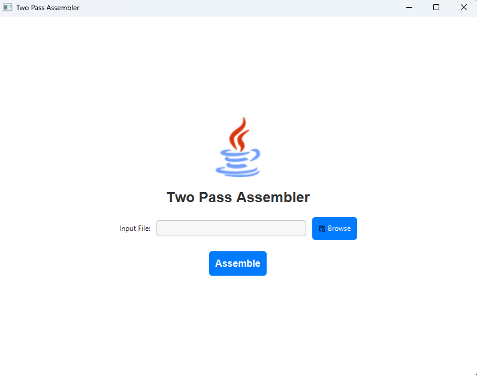
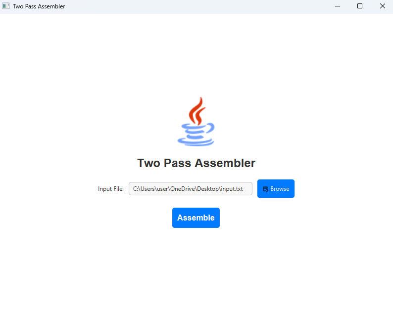
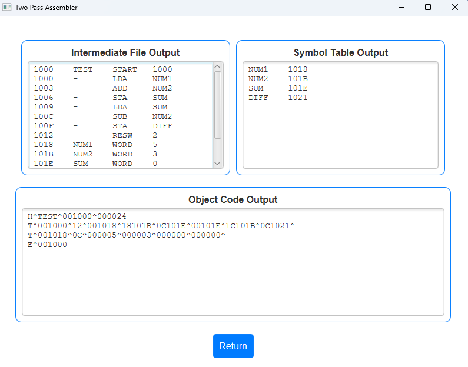

# **Two Pass Assembler**
This project is a Java-based implementation of a Two Pass Assembler, specifically designed for the SIC (Simplified Instructional Computer) assembly language. The assembler reads an assembly language program, translates it into machine code, and generates an intermediate file, symbol table, and object code output.

The graphical interface for this project is developed using JavaFX, providing an intuitive and user-friendly experience to input files, view outputs, and interact with the assembler.

## Features

- Two-Pass Assembly Process: Implements the standard two-pass algorithm for SIC assembler.
- Graphical User Interface: Developed using JavaFX, the GUI provides easy file input, and clear displays for the intermediate file, symbol table, and object code.
- Error Handling: Displays error messages for file reading issues and other exceptions.
- File Browsing: Built-in file browser for selecting input files directly from the GUI.

## Getting Started

### Prerequisites

To run the assembler application, you'll need:

Java Development Kit (JDK): Version 17 or higher.
JavaFX: Libraries for running JavaFX applications (included with JDK 17 and newer).

## File Format Requirements

The assembler expects an assembly language file as input. The format should be as follows:

First Line: START directive with program starting address (e.g., COPY START 1000).
Instruction Lines: Should contain labels (optional), operation codes, and operands.
End Line: The final line should include the END directive (e.g., END FIRST).

COPY&nbsp;&nbsp;&nbsp;&nbsp;START&nbsp;&nbsp;&nbsp;&nbsp;2000\
FIRST&nbsp;&nbsp;&nbsp;&nbsp;LDA&nbsp;&nbsp;&nbsp;&nbsp;&nbsp;&nbsp;&nbsp;&nbsp;FIVE\
\-&nbsp;&nbsp;&nbsp;&nbsp;&nbsp;&nbsp;&nbsp;&nbsp;&nbsp;&nbsp;&nbsp;&nbsp;STA&nbsp;&nbsp;&nbsp;&nbsp;&nbsp;&nbsp;&nbsp;&nbsp;&nbsp;ALPHA\
\-&nbsp;&nbsp;&nbsp;&nbsp;&nbsp;&nbsp;&nbsp;&nbsp;&nbsp;&nbsp;&nbsp;&nbsp;LDCH&nbsp;&nbsp;&nbsp;&nbsp;&nbsp;CHARZ\
\-&nbsp;&nbsp;&nbsp;&nbsp;&nbsp;&nbsp;&nbsp;&nbsp;&nbsp;&nbsp;&nbsp;&nbsp;STCH&nbsp;&nbsp;&nbsp;&nbsp;&nbsp;C1\
\-&nbsp;&nbsp;&nbsp;&nbsp;&nbsp;&nbsp;&nbsp;&nbsp;&nbsp;&nbsp;&nbsp;&nbsp;END&nbsp;&nbsp;&nbsp;&nbsp;&nbsp;&nbsp;&nbsp;FIRST

## Preloaded Optab

The program will work for the following opcodes
<table>
    <tr><th>Mnemonic</th><th>Opcode</th></tr>
    <tr><td>ADD</td><td>18</td></tr>
    <tr><td>AND</td><td>40</td></tr>
    <tr><td>COMP</td><td>28</td></tr>
    <tr><td>DIV</td><td>24</td></tr>
    <tr><td>J</td><td>3C</td></tr>
    <tr><td>JEQ</td><td>30</td></tr>
    <tr><td>JGT</td><td>34</td></tr>
    <tr><td>JLT</td><td>38</td></tr>
    <tr><td>JSUB</td><td>48</td></tr>
    <tr><td>LDA</td><td>00</td></tr>
    <tr><td>LDCH</td><td>50</td></tr>
    <tr><td>LDL</td><td>08</td></tr>
    <tr><td>LDX</td><td>04</td></tr>
    <tr><td>MUL</td><td>20</td></tr>
    <tr><td>OR</td><td>44</td></tr>
    <tr><td>RD</td><td>D8</td></tr>
    <tr><td>RSUB</td><td>4C</td></tr>
    <tr><td>STA</td><td>0C</td></tr>
    <tr><td>STCH</td><td>54</td></tr>
    <tr><td>STL</td><td>14</td></tr>
    <tr><td>STSW</td><td>E8</td></tr>
    <tr><td>STX</td><td>10</td></tr>
    <tr><td>SUB</td><td>1C</td></tr>
    <tr><td>TD</td><td>E0</td></tr>
    <tr><td>TIX</td><td>2C</td></tr>
    <tr><td>WD</td><td>DC</td></tr>
</table>

## Screenshots

